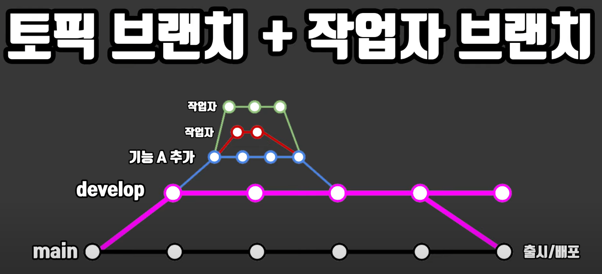

# Portfolio_UE4
3D Action RPG for Unreal Engine 4, Single Game

# Character

# Notice
- gitignore : Unreal Engine
- Engine Version : 4.26.2
- Project begin : Semptember 6
- VCS : git (using Sourcetree)
- IDE : Visual studio 2017

## Branch

- main
- - develop
- - - bug fix (bug branch)
- - - character (topic branch)
- - - map design (topic branch)
- - - etc (topic branch)

#### 1. 기본적으로 main 브랜치는 출시/배포 등을 위한 확실한 업데이트일때만 push.
#### 2. 대부분의 개발은 develop 브랜치에서 작업하며, 여기서 기능별로 브랜치를 나눠서 merge한다.
#### 3. 만약 해당 개발이 완성되지 않은 상태에서 여러 버그가 있다면, 그냥 거기서 직접 해결하여 push한다.
#### 4. 나중에 알 수 없는 이유로 버그가 생겼을때, 버그를 위한 브랜치를 새로 생성한뒤 해결하여 merge한다.
#### 5. 만약 아주 사소하고 가벼운 설정과 같은 버그였다면, 그냥 develop 브랜치에서 수정하고 push 한다.
